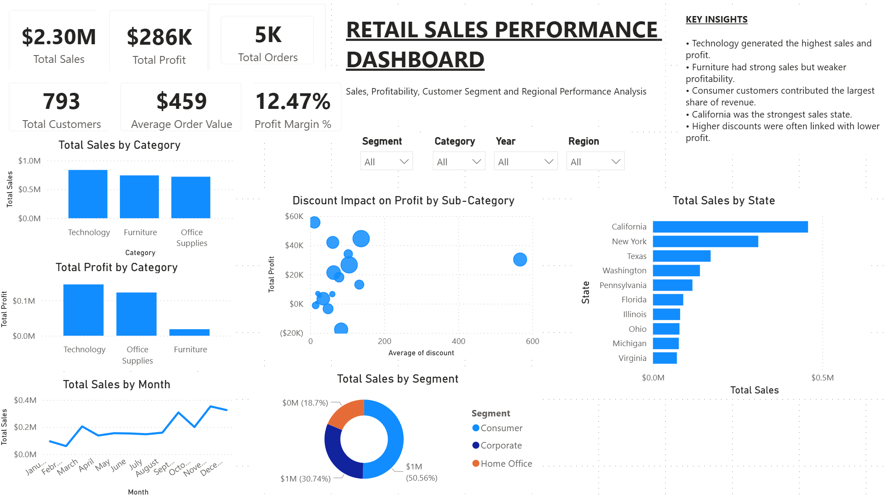
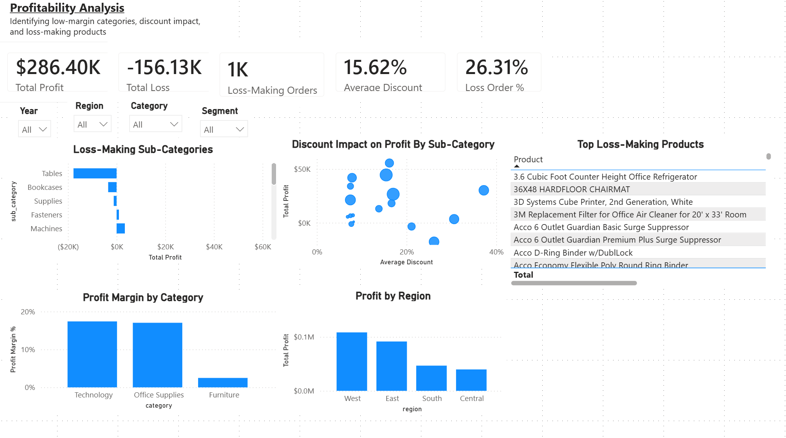

# Retail Sales Performance Dashboard

## Project Overview
This project analyses retail sales data to identify key business trends, profitability drivers, customer segment performance, regional sales patterns, and discount impact. The project uses Python for data cleaning and exploratory data analysis, and Power BI for interactive dashboard reporting.

## Business Objective
The objective of this project was to answer key business questions:

- Which product categories generate the highest sales and profit?
- Which customer segments contribute the most revenue?
- Which states perform best in sales?
- How do discounts impact profitability?
- Which products and sub-categories are loss-making?

## Tools Used
- Python
- pandas
- matplotlib
- Power BI
- DAX
- Jupyter Notebook

## Dashboard Pages
### 1. Retail Sales Performance Dashboard
This page provides an executive overview of sales, profit, orders, customers, average order value, profit margin, regional performance, customer segments, and category performance.

### 2. Profitability Analysis
This page focuses on profitability, including loss-making orders, discount impact, profit margin by category, profit by region, and loss-making products.

## Key Metrics
- Total Sales: $2.30M
- Total Profit: $286K
- Total Orders: 5K
- Total Customers: 793
- Average Order Value: $459
- Profit Margin: 12.47%

## Key Insights
- Technology generated the highest sales and profit.
- Furniture had strong sales but weaker profitability compared to other categories.
- Consumer customers contributed the largest share of revenue.
- California was the strongest sales state.
- Higher discount levels were linked with lower profitability.
- Profitability should be monitored alongside sales to avoid margin leakage.

## Data Cleaning and Preparation
The dataset was cleaned using Python. Key preparation steps included:

- Checked missing values and duplicate records
- Converted date columns into datetime format
- Created new fields such as order year, order month, shipping days, and profit margin
- Created KPI measures in Power BI using DAX
- Exported a cleaned CSV file for dashboard creation

## Files Included
- `Retail_Sales_Performance_Dashboard.pbix` — Power BI dashboard file
- `Retail_Sales_Data_Cleaning_EDA.ipynb` — Python notebook for cleaning and exploratory analysis
- `superstore_cleaned.csv` — cleaned dataset used in Power BI
- `images/` — dashboard screenshots

## Outcome
This project demonstrates practical skills in data cleaning, exploratory data analysis, Power BI dashboard design, DAX KPI creation, business reporting, and insight generation.
